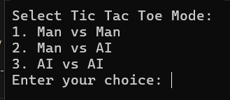
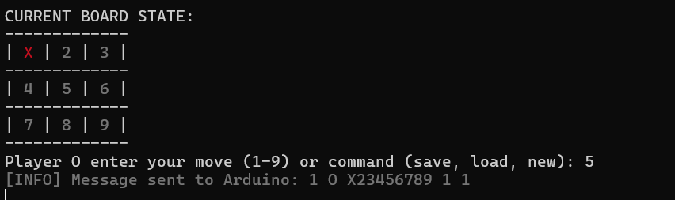
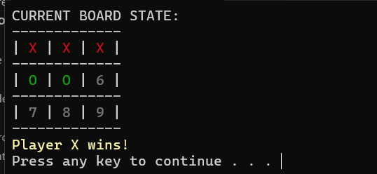

## Repository Details

This repository is for the **Computer Systems Automated Design** (CSAD) labs. The repository follows the naming convention `csad<YY1YY2><group><student's full name><student's number>`. 

In this case, the repository name would be structured as: `csad2425ki404zelenyytr07`

Main development branch: **develop**

## Task Details

1. Develop Server and Client.
2. Implement Tic Tac Toe Game
3. Game should have a menu that allows to configure parameters:
      - Man vs Man
      - Man vs AI
      - AI vs AI
   
   Action:
      - New
      - Save
      - Load


## Student Details and details from Table 1

| **Student Number** | **Student Name**            | **Group** | **Game**            | **Config format** |
|--------------------|-----------------------------|-----------|---------------------|-------------------|
| 07                 | Zelenyy Taras Romanovych    | KI-404    | tik-tac-toe 3x3     | XML               |


## Technologies, Programming Language, and Hardware

For the upcoming tasks, the following languages, and hardware will be used:

- **Programming Language**: C/C++
- **Hardware**: Arduino Nano
- **Enviroment**: 
   - VS code: To write and upload the logic code to the Arduino Uno, using C++ for low-level control.
   - Arduino IDE: To write and upload the logic code to the Arduino Uno, using C++ for low-level control.

## How to run project
### Server side
1) Clone repo using next command below:
```
https://github.com/Taras-Zelenyy/csad2425ki404zelenyytr07.git
```
2) Open `git bash`
3) Make checkout to feature/develop/task3. Use next command:
```
git checkout feature/develop/task3
```
4) Find next file usin following path: `your_path\server\server.ino`
5) Open Arduino IDE, choose you port (for me it's COM3), board and upload code

### Client side
1) Open `pull feature/develop/task3`
2) Navigate to `Action` tab
3) Choose last project build
4) Download artifacts
5) Unzip downloaded folder
6) Navigate to `"your_path\build-artifacts\Debug\client.exe"`
7) Double click to `client.exe`

## How it's work

At the beginning, the user is allowed to choose the game mode:


After the user selects the mode, the game starts:


At the end of the game, one of the players will receive a congratulation message:
